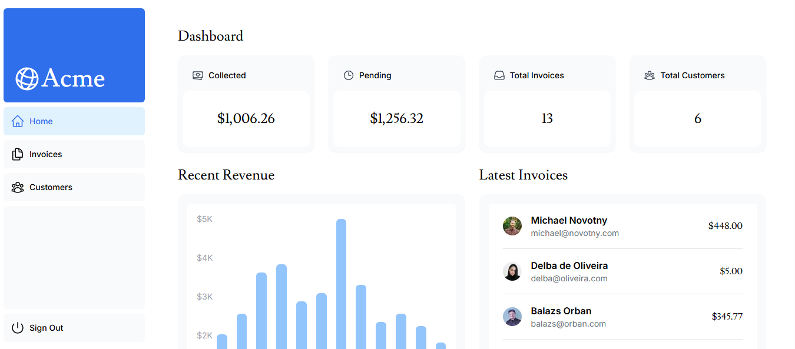
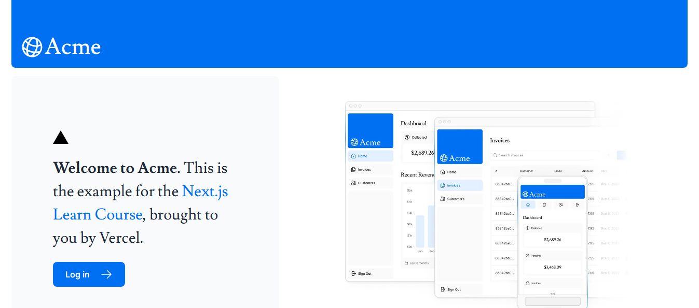
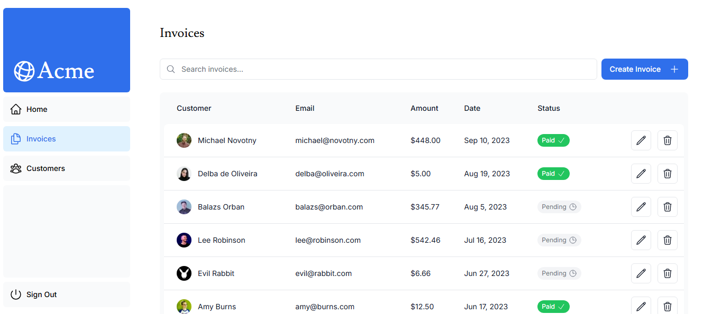

# 🧭 Next.js Admin Dashboard – Acme

[](https://nextjs-dashboard-pi-eight-68.vercel.app)
[](./LICENSE)
[](https://nextjs.org/)
[](https://tailwindcss.com/)

A modern, full-stack admin dashboard built with **Next.js 15**, **App Router**, **Tailwind CSS**, **PostgreSQL**, and **NextAuth.js**. This project simulates an internal tool for managing customers, invoices, revenue and authentication — perfect for SaaS products, admin panels, or business tools.



## 🚀 Features

- ✅ **Next.js 15** with App Router
- 🎨 Fully responsive UI with **Tailwind CSS**
- 🔐 **Authentication** with NextAuth.js
- 🔁 **React Server Actions** for data mutations
- 💾 **PostgreSQL** database (via Neon)
- 📊 Manage invoices, customers, and revenue
- 🧠 **Search, pagination, and filters**
- ⚡ Optimized rendering (static, dynamic, streaming)
- 🔍 **Metadata**, SEO, Open Graph and Favicon
- 🧩 Error boundaries (`error.tsx`, `not-found.tsx`)
- 🌐 Deployed on **Vercel**

## 🛠️ Tech Stack

| Tech         | Usage                               |
| ------------ | ----------------------------------- |
| Next.js 15   | App Router, Pages, Layouts, Routing |
| Tailwind CSS | UI styling                          |
| PostgreSQL   | Relational database (via Neon)      |
| Prisma ORM   | Database access (optional)          |
| NextAuth.js  | Authentication & session management |
| Vercel       | Deployment platform                 |

## 📸 Screenshots


  


## 🧪 Getting Started

Clone the repo:

```bash
git clone https://github.com/sofiane-abou-abderrahim/nextjs-dashboard.git
cd nextjs-dashboard
```

Install dependencies:

```bash
pnpm install
# or
npm install
```

Set up your `.env.local` file:

```env
DATABASE_URL=your_postgres_url
NEXTAUTH_SECRET=your_nextauth_secret
NEXTAUTH_URL=http://localhost:3000
```

Push schema to your database:

```bash
npx prisma db push
```

(Optional) Seed the database:

```bash
npx prisma db seed
```

Run the dev server:

```bash
pnpm dev
# or
npm run dev
```

## 🧩 Folder Structure

```
app/
  ├─ dashboard/
  ├─ login/
  ├─ api/
  ├─ components/
  ├─ lib/
  ├─ styles/
  ├─ layout.tsx
  ├─ page.tsx
```

## ✅ Roadmap

- [x] Dashboard UI
- [x] Authentication with NextAuth.js
- [x] PostgreSQL integration
- [x] Form validation + error handling
- [x] SEO and Metadata
- [ ] Role-based access control (RBAC)
- [ ] Internationalization (i18n)

## 📦 Deployment

The project is ready for deployment on [Vercel](https://vercel.com).

```bash
# Build for production
pnpm build

# Start the server
pnpm start
```

## 🤝 Contributing

Contributions are welcome! Feel free to fork the repo and submit a PR.

## 📄 License

MIT

---

## 🔗 Live Demo

👉 [https://nextjs-dashboard-pi-eight-68.vercel.app/](https://nextjs-dashboard-pi-eight-68.vercel.app/)

---

## 👤 Author

**[Sofiane Abou Abderrahim](https://github.com/sofiane-abou-abderrahim)** – Freelance developer focused on building modern, scalable web applications using React, Next.js and TypeScript.
